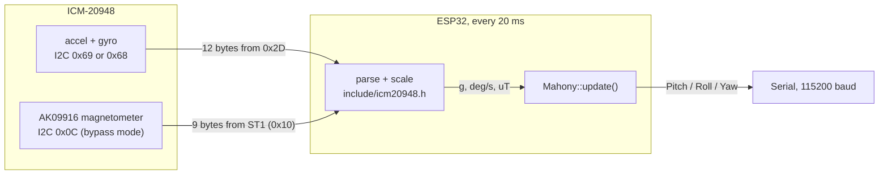

# CEOs-Project-IMU

ESP32 firmware that reads a TDK **ICM-20948** 9-axis IMU over I2C, fuses
accelerometer, gyroscope and magnetometer data with a **Mahony** AHRS filter,
and prints the estimated orientation (pitch, roll, yaw in degrees) on the
serial port at 50 Hz.

Built with PlatformIO and the Arduino framework. The filter is
[paulstoffregen/Mahony](https://github.com/PaulStoffregen/MahonyAHRS).

## Hardware

| Part | Notes |
|---|---|
| ESP32 board | Configured for the uPesy ESP32 Wroom DevKit (`upesy_wroom`). Any ESP32 dev board with the default I2C pins should work after changing `board` in `platformio.ini`. |
| ICM-20948 breakout | Contains the accelerometer/gyroscope and an AK09916 magnetometer die. |

### Wiring

| ICM-20948 breakout | ESP32 |
|---|---|
| VIN / 3V3 | 3V3 |
| GND | GND |
| SDA | GPIO 21 (default `SDA`) |
| SCL | GPIO 22 (default `SCL`) |
| AD0 | Selects the I2C address: high = `0x69`, low = `0x68`. The firmware tries both. |

The I2C bus runs at the Arduino default of 100 kHz. Most breakouts already
have the SDA/SCL pull-up resistors.

## What the firmware does



**`setup()`**

1. Starts `Serial` at 115200 baud and I2C on the default pins.
2. Looks for the sensor at `0x69`, then `0x68`, and halts with
   `ICM-20948 não encontrado!` if neither answers.
3. Checks `WHO_AM_I` (`0xEA`) so a different IMU on the same address is
   rejected.
4. Wakes the chip. It comes out of reset in sleep mode (`PWR_MGMT_1 = 0x41`),
   and all data registers read zero until `SLEEP` is cleared.
5. Enables I2C bypass (`INT_PIN_CFG.BYPASS_EN`) so the AK09916 magnetometer
   appears on the bus at `0x0C`, checks its ID (`WIA2 = 0x09`) and puts it in
   continuous 100 Hz mode. If it is missing, the firmware keeps running in
   6-axis mode.

**`loop()`**, every 20 ms (50 Hz):

1. Reads `ACCEL_XOUT_H..GYRO_ZOUT_L` (12 bytes, big-endian) and converts
   them with the reset-default full-scale ranges: accelerometer +-2 g
   (16384 LSB/g), gyroscope +-250 dps (131 LSB/dps).
2. Reads the magnetometer block `ST1..ST2` (9 bytes, little-endian). A new
   sample is used only if `ST1.DRDY` is set and `ST2.HOFL` (overflow) is
   clear; otherwise the previous sample is kept. Values are scaled by
   0.15 uT/LSB, and Y and Z are negated because the AK09916 axes point the
   other way from the accelerometer/gyroscope axes.
3. Calls `Mahony::update(gx, gy, gz, ax, ay, az, mx, my, mz)` with the gyro
   in **degrees per second**, which is what this library expects (it
   converts to rad/s internally). If no magnetometer sample exists yet, the
   library uses its 6-axis update.
4. Prints one line per sample.

### Serial output

At startup:

```
ICM-20948 encontrado no endereço: 0x69        (or 0x68, depending on AD0)
AK09916 magnetometer found (continuous mode, 100 Hz)
```

Then, 50 times per second:

```
Pitch: <degrees> Roll: <degrees> Yaw: <degrees>
```

Values are printed with two decimals. With this library, pitch is in
[-90, 90], roll in [-180, 180] and yaw in [0, 360] (it adds 180 to the
filter's heading). The angles are in the sensor's own axes, as marked on
the breakout.

## Build, flash, monitor

Requires [PlatformIO Core](https://docs.platformio.org/en/latest/core/installation/index.html)
(`pip install platformio`) or the PlatformIO IDE extension for VS Code.

```sh
pio run                     # build the firmware
pio run -t upload           # flash the board over USB
pio device monitor          # open the serial monitor (115200 baud)
```

## Tests

The register constants and raw-to-physical conversions are in
`include/icm20948.h`, which has no Arduino dependency, so they are tested on
the host with Unity:

```sh
pio test -e native
```

The tests check byte order (big-endian accel/gyro, little-endian
magnetometer), scale factors at full scale, that the gyro stays in deg/s,
the magnetometer axis flip, and the not-ready and overflow cases.

CI (`.github/workflows/ci.yml`) builds the ESP32 firmware and runs these
tests on every pull request. There is no hardware-in-the-loop test: the
sensor initialisation and I2C reads are checked against the datasheets and
by compiling, not by CI.

## Limitations

- **No calibration.** Gyro bias is not measured at startup, and the filter's
  integral gain is 0 (library default), so a constant gyro bias shows up as
  slow drift. The magnetometer has no hard-iron or soft-iron correction, so
  yaw is offset near metal or other electronics.
- **Accelerometer as gravity reference.** Mahony corrects tilt with the
  accelerometer, which assumes the sensor is not accelerating. Sustained
  acceleration tilts the estimate.
- **Default full-scale ranges.** +-2 g and +-250 dps saturate under strong
  acceleration or fast rotation. Larger ranges need writes to `ACCEL_CONFIG`
  and `GYRO_CONFIG_1` (User Bank 2) and matching scale factors.
- **Fixed 50 Hz timing** from `millis()`, not from the sensor's data-ready
  interrupt.
- The Mahony filter itself is not unit-tested on the host: its `invSqrt`
  uses a `float`/`long` union that only works where `long` is 32 bits (true
  on the ESP32, not on 64-bit desktops).

## Layout

```
src/main.cpp                      setup(), loop(), I2C helpers
include/icm20948.h                register map, parsing, scale factors
test/test_conversions/            host unit tests (Unity)
platformio.ini                    upesy_wroom (firmware) and native (tests) environments
```
